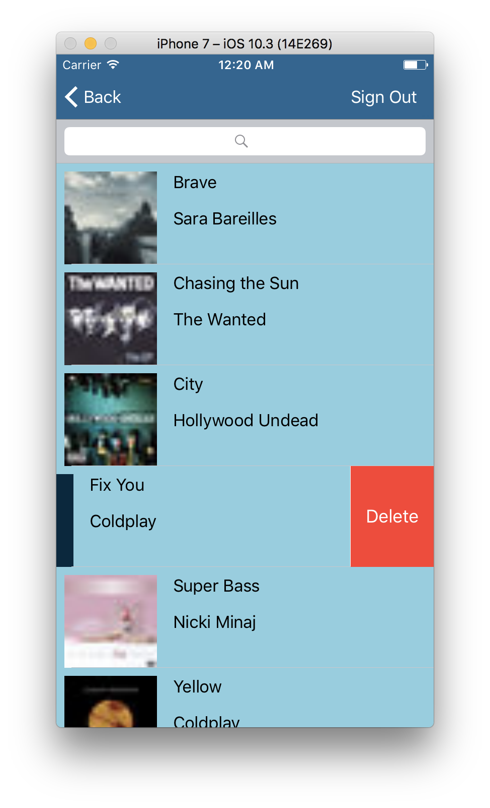

# MusicListenList
Native App Studio - App 6

App allows users to log in using Firebase. 
Users can then search for music using the iTunes API [1].
Many thanks to raywenderlich.com for their clear tutorial on Firebase!

NOTE: I had to downgrade Firebase to version 3.15 because of some major bugs. 

Sources: 
[1] https://affiliate.itunes.apple.com/resources/documentation/itunes-store-web-service-search-api/
[2] https://www.raywenderlich.com/139322/firebase-tutorial-getting-started-2
